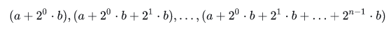
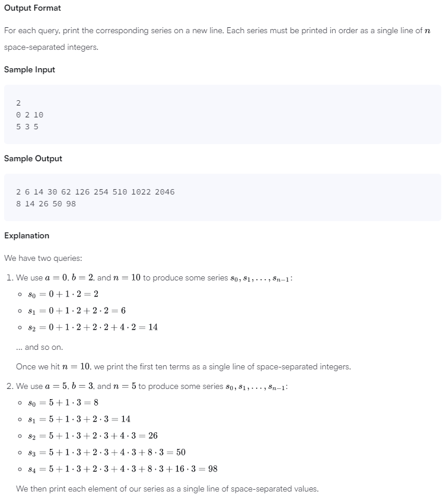

# Java Challenge-06

We use the integers , , and  to create the following series:

You are given  queries in the form of , , and . For each query, print the series corresponding to the given , , and  values as a single line of  space-separated integers.

Input Format

The first line contains an integer, , denoting the number of queries.
Each line  of the  subsequent lines contains three space-separated integers describing the respective , , and  values for that query.

Constraints

Output Format

For each query, print the corresponding series on a new line. Each series must be printed in order as a single line of  space-separated integers.

Sample Input

2
0 2 10
5 3 5
Sample Output

2 6 14 30 62 126 254 510 1022 2046
8 14 26 50 98
Explanation

We have two queries:

We use , , and  to produce some series :

... and so on.

Once we hit , we print the first ten terms as a single line of space-separated integers.

We use , , and  to produce some series :

We then print each element of our series as a single line of space-separated values.

Language
Java 7
More
678910111213141516171819202122232425262728293031323334353637383940414243
    }
}

46class Solution {    private static void printSerie(int a, int b, int n) {
Line: 43 Col: 1

Test against custom input

## Screenshoots

