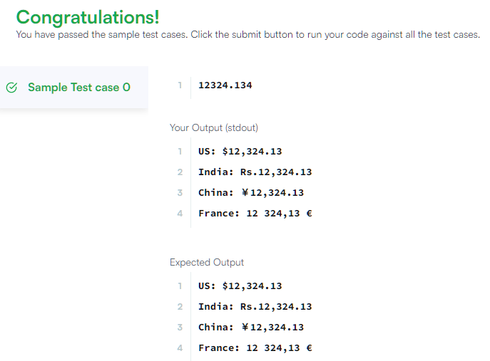

# Java Challenge-09
Given a double-precision number, , denoting an amount of money, use the NumberFormat class' getCurrencyInstance method to convert  into the US, Indian, Chinese, and French currency formats. Then print the formatted values as follows:

US: formattedPayment
India: formattedPayment
China: formattedPayment
France: formattedPayment
where  is  formatted according to the appropriate Locale's currency.

Note: India does not have a built-in Locale, so you must construct one where the language is en (i.e., English).

Input Format

A single double-precision number denoting .

Constraints

Output Format

On the first line, print US: u where  is  formatted for US currency.
On the second line, print India: i where  is  formatted for Indian currency.
On the third line, print China: c where  is  formatted for Chinese currency.
On the fourth line, print France: f, where  is  formatted for French currency.

Sample Input

12324.134
Sample Output

US: $12,324.13
India: Rs.12,324.13
China: ￥12,324.13
France: 12 324,13 €

Explanation

Each line contains the value of  formatted according to the four countries' respective currencies.

## Snapshoots

