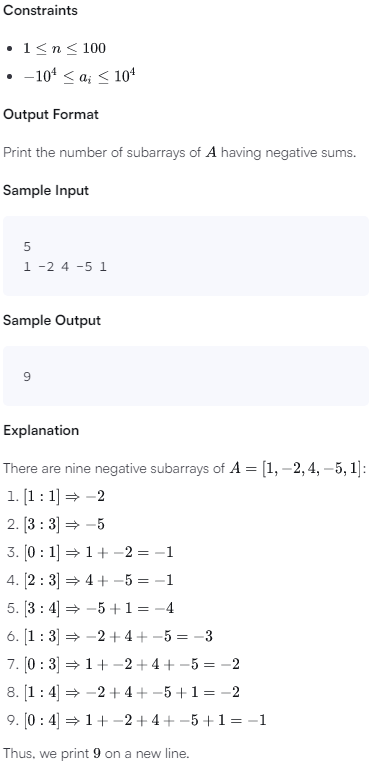
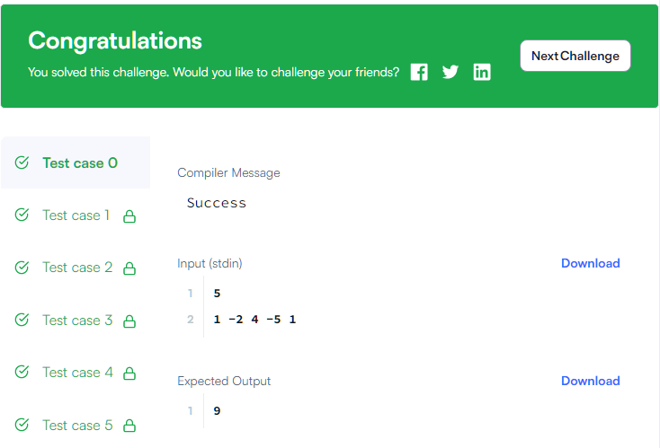
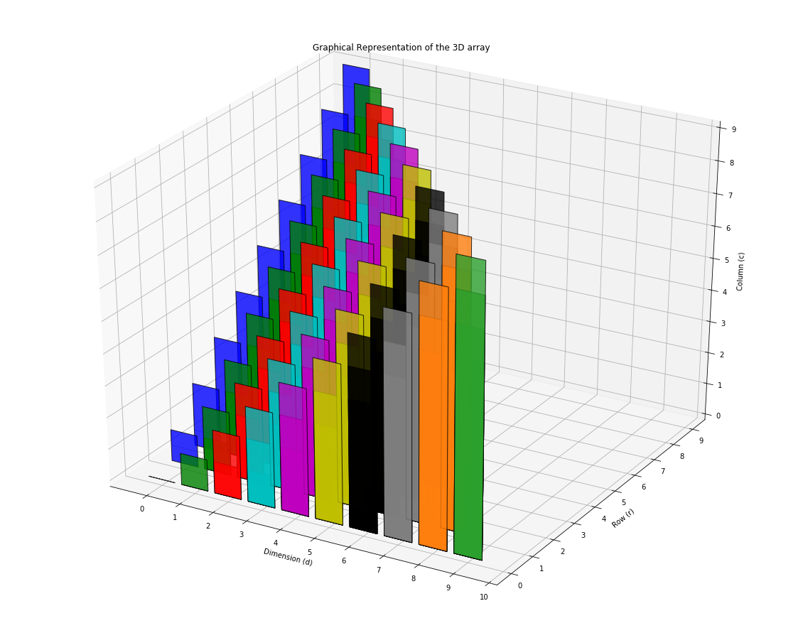

# Java Challenge-22

We define the following:

A subarray of an -element array is an array composed from a contiguous block of the original array's elements. 
For example, if array = [1,2,3], then the subarrays are [1], [2], [3], [1,2], [2,3], and [1,2,3]. 

Something like [1,3] would not be a subarray as it's not a contiguous subsection of the original array.

The sum of an array is the total sum of its elements.
An array's sum is negative if the total sum of its elements is negative.
An array's sum is positive if the total sum of its elements is positive.
Given an array of n integers, find and print its number of negative subarrays on a new line.

Input Format

The first line contains a single integer, n, denoting the length of array A=[a1,a2,a3,...a(n-1)].
The second line contains n space-separated integers describing each respective element, ai, in array A.

