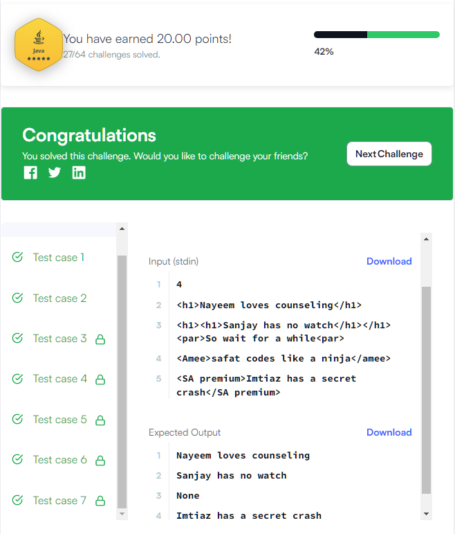

# Java Challenge-28

In a tag-based language like XML or HTML, contents are enclosed between a start tag and an end tag like <tag>contents</tag>. Note that the corresponding end tag starts with a /.

Given a string of text in a tag-based language, parse this text and retrieve the contents enclosed within sequences of well-organized tags meeting the following criterion:

The name of the start and end tags must be same. The HTML code `<h1>Hello World</h2>` is not valid, because the text starts with an h1 tag and ends with a non-matching h2 tag.

Tags can be nested, but content between nested tags is considered not valid. For example, in `<h1><a>contents</a>invalid</h1>`, contents is valid but invalid is not valid.

Tags can consist of any printable characters.

Input Format

The first line of input contains a single integer, N (the number of lines).
The N subsequent lines each contain a line of text.

Output Format

For each line, print the content enclosed within valid tags.
If a line contains multiple instances of valid content, 
print out each instance of valid content on a new line; if no valid content is found, print None.

Sample Input

```
4
<h1>Nayeem loves counseling</h1>
<h1><h1>Sanjay has no watch</h1></h1><par>So wait for a while</par>
<Amee>safat codes like a ninja</amee>
<SA premium>Imtiaz has a secret crush</SA premium>
```

Sample Output
```
Nayeem loves counseling
Sanjay has no watch
So wait for a while
None
Imtiaz has a secret crush
```



