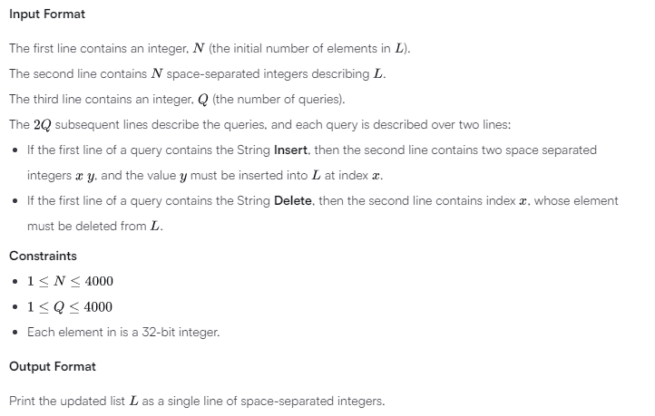
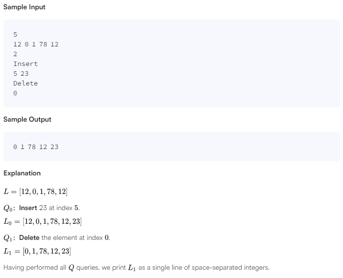

# Java Challenge-50

For this problem, we have 2 types of queries you can perform on a List:

Insert y at index x:

```
Insert
x y
```

Delete the element at index x:

```
Delete
x
```

Given a list, L, of N integers, perform Q queries on the list. Once all queries are completed, print the modified list as a single line of space-separated integers.





