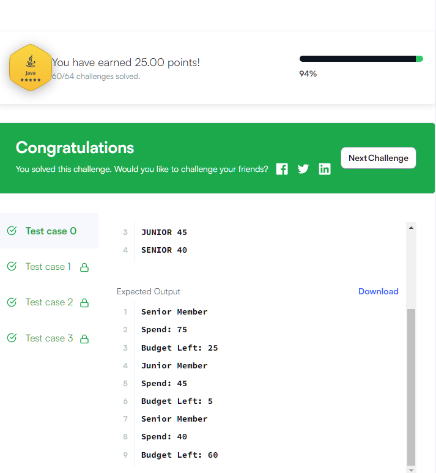

# Java Challenge-61

Java annotation can be used to define the metadata of a Java class or class element. We can use Java annotation at the compile time to instruct the compiler about the build process. Annotation is also used at runtime to get insight into the properties of class elements.

Java annotation can be added to an element in the following way:

```java
@Entity
Class DemoClass {}
```

We can also set a value to the annotation member. For example:

```java
@Entity(EntityName="DemoClass")
Class DemoClass{}
```

In Java, there are several built-in annotations. You can also define your own annotations in the following way:

```java
@Target(ElementType.METHOD)
@Retention(RetentionPolicy.RUNTIME)
@interface FamilyBudget {
   String userRole() default "GUEST";
}
```

Here, we define an annotation *FamilyBudget*, where *userRole* is the only member in that custom annotation. The userRole takes only String type values, and the default is "GUEST". If we do not define the value for this annotation member, then it takes the default. By using @Target, we can specify where our annotation can be used. For example, the FamilyBudget annotation can only be used with the method in a class. @Retention defines whether the annotation is available at runtime. To learn more about Java annotation, you can read the tutorial and oracle docs.

Your task is to complete the FamilyBudget annotation and the FamilyMember class so that the Solution class works perfectly with the defined constraints.

Note: You must complete the 5 incomplete lines in the editor. You are not allowed to change, delete or modify any other lines. To restore the original code, click on the top-left button on the editor and create a new buffer.

Input Format

The first line of input contains an integer N representing the total number of test cases. Each test case contains a string and an integer separated by a space on a single line in the following format:

`UserRole MoneySpend`

Output Format

Based on the user role and budget outputs, output the contents of the certain method. If the amount of money spent is over the budget limit, then output Budget Limit Over.

Sample Input

```
3
SENIOR 75
JUNIOR 45
SENIOR 40
```

Sample Output

```
Senior Member
Spend: 75
Budget Left: 25
Junior Member
Spend: 45
Budget Left: 5
Senior Member
Spend: 40
Budget Left: 60
```

___




