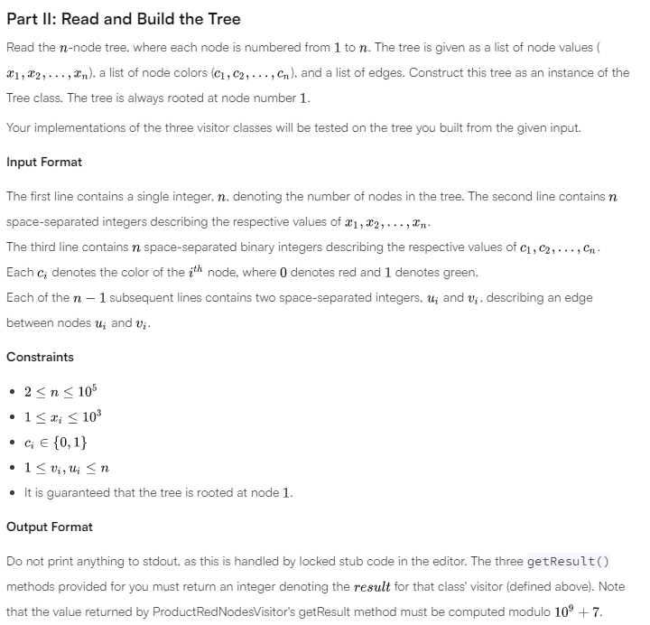
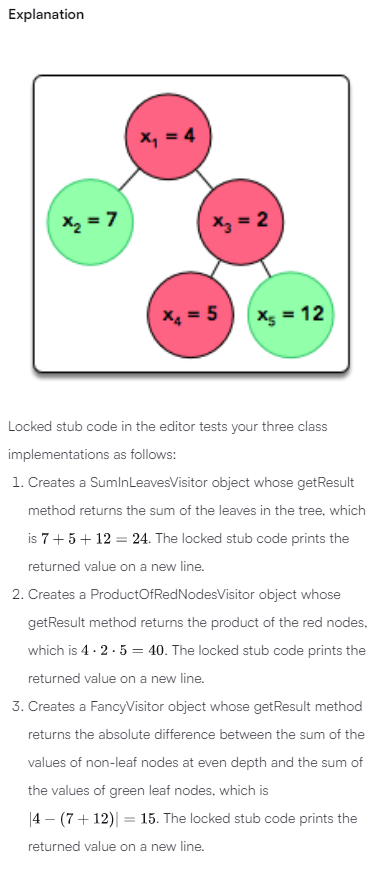

# Java Challenge-63

Note: In this problem you must NOT generate any output on your own. Any such solution will be considered as being against the rules and its author will be disqualified. The output of your solution must be generated by the uneditable code provided for you in the solution template.

https://runestone.academy/ns/books/published/pythonds/Trees/VocabularyandDefinitions.html

An important concept in Object-Oriented Programming is the open/closed principle, which means writing code that is open to extension but closed to modification. In other words, new functionality should be added by writing an extension for the existing code rather than modifying it and potentially breaking other code that uses it. This challenge simulates a real-life problem where the open/closed principle can and should be applied.

A Tree class implementing a rooted tree is provided in the editor. It has the following publicly available methods:

getValue(): Returns the value stored in the node.
getColor(): Returns the color of the node.
getDepth(): Returns the depth of the node. Recall that the depth of a node is the number of edges between the node and the tree's root, so the tree's root has depth  and each descendant node's depth is equal to the depth of its parent node .
In this challenge, we treat the internal implementation of the tree as being closed to modification, so we cannot directly modify it; however, as with real-world situations, the implementation is written in such a way that it allows external classes to extend and build upon its functionality. More specifically, it allows objects of the TreeVis class (a Visitor Design Pattern) to visit the tree and traverse the tree structure via the accept method.

There are two parts to this challenge.

## Part I: Implement Three Different Visitors

Each class has three methods you must write implementations for:

getResult(): Return an integer denoting the , which is different for each class:

The SumInLeavesVisitor implementation must return the sum of the values in the tree's leaves only.
The ProductRedNodesVisitor implementation must return the product of values stored in all red nodes, including leaves, computed modulo . Note that the product of zero values is equal to .
The FancyVisitor implementation must return the absolute difference between the sum of values stored in the tree's non-leaf nodes at even depth and the sum of values stored in the tree's green leaf nodes. Recall that zero is an even number.
visitNode(TreeNode node): Implement the logic responsible for visiting the tree's non-leaf nodes such that the getResult method returns the correct  for the implementing class' visitor.

visitLeaf(TreeLeaf leaf): Implement the logic responsible for visiting the tree's leaf nodes such that the getResult method returns the correct  for the implementing class' visitor.




## Sample Input

```java
5
4 7 2 5 12
0 1 0 0 1
1 2
1 3
3 4
3 5
```

## Sample Output

```java
24
40
15
```


___


